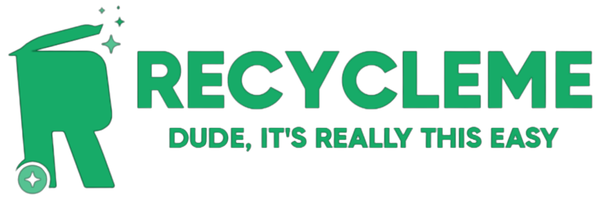

# RecycleMe - Web App

<div>
    <a href="https://play.google.com/store/apps/details?id=com.aankur01.greendayfrontend">
        
    </a>
    <a href="https://apps.apple.com/us/app/recycleme-usa/id1615887126">
        
    </a>
    <a href="https://green-day-web.vercel.app/">
        
    </a>
</div>

RecycleMe is an image recognition-based recycling management system powered by Google Vision.  
This project aims at making recycling faster and more convenient.  
The user can take a picture of a certain item and our Machine Learning Model will determine its recyclability and where to recycle it.  
Our map takes in a collection of data from the Google Maps API and user-generated data by both our standard users and by businesses.

## 🪧 Demo: https://youtu.be/fDI_Rpqul88

## 🌐 Web Deployment Details
Here: https://green-day-web.vercel.app/ (best in Chrome and Microsoft Edge)
1. You are more than welcome to read our Landing Page for a brief introduction of our project!
2. Click "Get Started" to come to the Home page
3. Go to the Map to enter your location and search for trash cans or recycling businesses near you (you **DO NOT** have to log in to use the Map)
   * For trash cans: we will display one picture within a marker of its location
   * For recycling businesses: we will show all the details of the business to you, including all the information and its picture
4. Log in with your Email or Google Account
5. Add your own business in the Settings, including but not limited to business Name, Phone, Address, Recycling Types, and Time Availability
6. Attach the best picture to show your business in the Gallery

## ⌨️ Our Codes
1. Download the zip of this repository
2. ```npm install``` or ```yarn install```
3. Fill in all API keys in .env.local (currently this repository is private, so we kept the keys inside it to ease your testing)
4. ```npm run dev``` or ```yarn dev```
5. Open [http://localhost:3000](http://localhost:3000) with your browser to see the result

## 📧 Contact Us
Contact us at nextchart.beachrock@gmail.com for anything!
